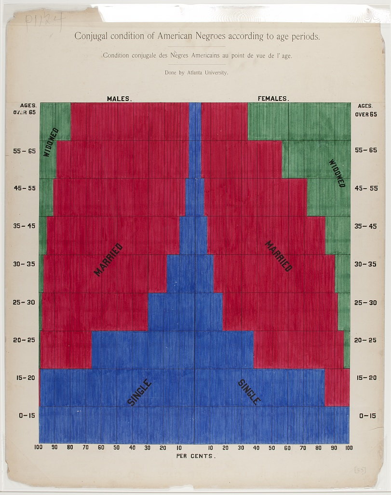

```{r setup, include=FALSE}
knitr::opts_chunk$set(echo = TRUE, message = FALSE, warning = FALSE)
library(tidyverse)
library(infer)
library(broom)
library(openintro)
library(kableExtra)

library(usmap)
library(maps)
library(ggpubr)

library(praise)
set.seed(4747)
```

### The Data

The data this week are set up to recreate some of the beautiful visualizations made by W.E.B. DuBois who was, among many other things, a civil rights activist and data viz pioneer.

The data were compiled by [Anthony Starks](https://twitter.com/ajstarks), [Allen Hillery](https://twitter.com/AlDatavizguy/status/1358454676497313792?s=20) [Sekou Tyler](https://twitter.com/sqlsekou/status/1360281040657522689?s=20). 
Note that [Anthony Starks](https://twitter.com/AlDatavizguy/status/1358454677445218304?s=20) has provided many examples and data preparation, including a ["style guide"](https://github.com/ajstarks/dubois-data-portraits/blob/master/dubois-style.pdf) and [article](https://medium.com/nightingale/recreating-w-e-b-du-boiss-data-portraits-87dd36096f34).

To get the data (and the viz!) I used: 

`svn checkout https://github.com/ajstarks/dubois-data-portraits/trunk/challenge/2022/challenge07`

and then moved the files related to Challenge07 into this week's folder.

```{r echo = FALSE, fig.cap = "Original image", fig.show = 'hold', fig.ncol = 2, out.width='47%', fig.align='center'}

```

```{r}
data <- read_csv("challenge07/data.csv")
females <- read_csv("challenge07/females.csv")
males <- read_csv("challenge07/males.csv")
```

##  The plot

I'm going to start by flipping the x and y axes, and also use only the females.

```{r}
all_tidy <- data %>%
  pivot_longer(cols = c("Widowed", "Married", "Single"), names_to = "status",
               values_to = "count") %>%
  mutate(status = factor(status, levels = c("Widowed", "Married", "Single"))) %>%
  mutate(`PER CENTS.` = ifelse(Gender == "Male", -count, count))
  
```


```{r}
guide_axis_label_trans <- function(label_trans = identity, ...) {
  axis_guide <- guide_axis(...)
  axis_guide$label_trans <- rlang::as_function(label_trans)
  class(axis_guide) <- c("guide_axis_trans", class(axis_guide))
  axis_guide
}

guide_train.guide_axis_trans <- function(x, ...) {
  trained <- NextMethod()
  trained$key$.label <- x$label_trans(trained$key$.label)
  trained
}

```


```{r fig.width = 8, fig.height = 8}
all_tidy %>%
  ggplot(aes(x = Group, y = `PER CENTS.`, fill = status)) + 
  geom_bar(stat = "identity", width = 1) +
  scale_fill_manual(values = c("#06b48b", "#D5174e", "#0343df")) + 
  scale_y_continuous(labels = abs, limits = c(-100,100)) + 
  coord_flip() +
  theme_minimal() + 
  theme(legend.position = "none") +
  xlab("") + 
  ggtitle("AGES.") +
  geom_vline(xintercept = seq(0.5,9.5,1), color = "black", size = 0.1) +
  geom_hline(yintercept = seq(-100, 100, by = 1), color = "black",
             size = 0.1) #+
  #guides(x.sec = guide_axis_label_trans(~.x))

```


```{r}
praise()
```

