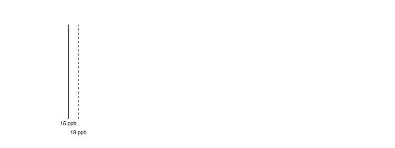
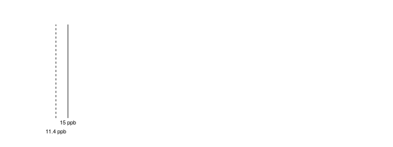

<!--
needed the following in terminal:
quarto add qmd-lab/closeread
-->

```{r}
library(tidyverse) # ggplot, lubridate, dplyr, stringr, readr...
library(praise)
library(gganimate)
library(gifski)
library(magick)
```

## The Data

This week we are exploring lead levels in water samples collected in Flint, Michigan in 2015. The data comes from a paper by [Loux and Gibson (2018)](https://onlinelibrary.wiley.com/doi/pdf/10.1111/test.12187?casa_token=av3lP7OmqS0AAAAA:QAF3yU5kGzsUkqi1VlXkMlIN8ExolHZBSkdJ3hIHnlptUES57dGVoXjE3qdwPPHtLHNRd9VvX1x8f6VN) who advocate for using this data as a teaching example in introductory statistics courses.

> The Flint lead data provide a compelling example for introducing students to simple univariate descriptive statistics. In addition, they provide examples for discussion of sampling and data collection, as well as ethical data handling.

The data this week includes samples collected by the Michigan Department of Environment (MDEQ) and data from a citizen science project coordinated by Prof Marc Edwards and colleagues at Virginia Tech. Community-sourced samples were collected after concerns were raised about the MDEQ excluding samples from their data. You can read about the ["murky" story behind this data here](https://academic.oup.com/jrssig/article/14/2/16/7029247).

```{r}
flint_mdeq <- readr::read_csv('https://raw.githubusercontent.com/rfordatascience/tidytuesday/main/data/2025/2025-11-04/flint_mdeq.csv')
flint_vt <- readr::read_csv('https://raw.githubusercontent.com/rfordatascience/tidytuesday/main/data/2025/2025-11-04/flint_vt.csv')
```

# The raw data

```{r}
n_drop <- 10
n_stay <- 5

df1 <- flint_mdeq |>
  mutate(dot_id = row_number()) |> 
  select(dot_id, lead)

total_frames <- max(df1$dot_id) + n_drop + n_stay - 1
  
df2 <- expand_grid(
    dot_id = df1$dot_id, 
    frame = 1:total_frames) |>  # cross join: each dot × frame
  left_join(df1, by = "dot_id") |>
  left_join(df1 |> mutate(start_frame = dot_id), by = "dot_id") |> 
  mutate(y = case_when(
    frame <= start_frame ~ 10,
    frame <= start_frame + n_drop - 1 ~ 10 - (frame - start_frame) * (10 / (n_drop - 1)),
    frame <= start_frame + n_drop + n_stay - 1 ~ 0,
    TRUE ~ 0)) |> 
  mutate(dot_alpha = case_when(
  y > 9.5 ~ 0,
  y == 0  ~ 0.6,
  TRUE ~ 0.3
))
```


```{r}
ref_lines <- tibble(
  x = c(15, quantile(flint_mdeq$lead, 0.9)),
  xend = c(15, quantile(flint_mdeq$lead, 0.9)),
  y = c(-0.5, -0.5),
  yend = c(10, 10),
  lty = c(1, 2)
)


labels <- tibble(
  label = c("15 ppb", "18 ppb"),
  x = c(15, 18),
  y = c(-1, -2)
)
```


```{r}

p <- ggplot(df2, aes(x = lead.x, y = y)) +
  geom_point(color = "steelblue", 
             size = 7,
             alpha = df2$dot_alpha) +
  geom_segment(data = ref_lines,
               aes(x = x, xend = xend, y = y, 
                   yend = yend), 
               linetype = c(1,2),
               inherit.aes = FALSE,
               color = "black")  +
  geom_text(data = labels,
            aes(x = x, y = y, label = label),
            inherit.aes = FALSE) +
  ylim(-3, 12) + 
  xlim(0, 107) + 
  transition_manual(frame) +
  theme_void() 

```

```{r}
#| eval: false

# run this R chunk before rendering
# don't evaluate on render, run through the frames in the scrollytelling

dir.create("frames", showWarnings = FALSE)

animate(p, fps = 20, width = 800, height = 300,
        renderer = file_renderer("frames", prefix = "frame_"))
```


```{=html}
<style>
.scrolly-container {
  display: grid;
  grid-template-columns: 70% 30%; /* plot 70%, text 30% */
  gap: 2rem;
  align-items: start;
  margin-top: 10vh;
}

#scroll-anim {
  position: sticky;
  top: 20px;
  width: 100%;
}

.step {
  margin: 60vh 0;  /* space between blocks */
}
</style>

<div class="scrolly-container">
  

  <div>
    <div class="step">Samples were collected by the Michigan Department of Environment (MDEQ) because of reports of high lead levels in the water.</div>
    <div class="step">If the 90th percentile of the samples was above 15 ppb (solid line), action would be required to be taken.</div>
    <div class="step">There is clear evidence in the raw data that the 90th percentile is above the cutoff and should activate further inquiry.</div>
    <div class="step"></div>
  </div>
</div>

<script>
const frameCount = 85
const frame = idx => `frames/frame_${String(idx).padStart(4,'0')}.png`

// preload
for (let i = 1; i <= frameCount; i++) {
  const img = new Image()
  img.src = frame(i)
}

const img = document.getElementById('scroll-anim')
const container = document.querySelector('.scrolly-container')

window.addEventListener('scroll', () => {
  const rect = container.getBoundingClientRect()
  const start = rect.top
  const end = rect.bottom - window.innerHeight

  // percentage along THIS container only
  const fraction = (0 - start) / (end - start)
  const idx = Math.min(frameCount - 1, Math.max(0, Math.floor(fraction * frameCount)))

  img.src = frame(idx + 1)
})
</script>
```

# Two samples removed

```{r}
n_drop <- 10
n_stay <- 5

df1.2 <- flint_mdeq |>
  filter(!is.na(lead2)) |> 
  mutate(dot_id = row_number()) |> 
  select(dot_id, lead2)

total_frames.2 <- max(df1.2$dot_id) + n_drop + n_stay - 1
  
df2.2 <- expand_grid(
    dot_id = df1.2$dot_id, 
    frame = 1:total_frames.2) |>  # cross join: each dot × frame
  left_join(df1.2, by = "dot_id") |>
  left_join(df1.2 |> mutate(start_frame = dot_id), by = "dot_id") |> 
  mutate(y = case_when(
    frame <= start_frame ~ 10,
    frame <= start_frame + n_drop - 1 ~ 10 - (frame - start_frame) * (10 / (n_drop - 1)),
    frame <= start_frame + n_drop + n_stay - 1 ~ 0,
    TRUE ~ 0)) |> 
  mutate(dot_alpha = case_when(
  y > 9.5 ~ 0,
  y == 0  ~ 0.6,
  TRUE ~ 0.3
))
```


```{r}
ref_lines2 <- tibble(
  x = c(15, quantile(flint_mdeq$lead2, 0.9, na.rm = TRUE)),
  xend = c(15, quantile(flint_mdeq$lead2, 0.9, na.rm = TRUE)),
  y = c(-0.5, -0.5),
  yend = c(10, 10),
  lty = c(1, 2)
)


labels2 <- tibble(
  label = c("15 ppb", "11.4 ppb"),
  x = c(15, 11.4),
  y = c(-1, -2)
)
```


```{r}

p2 <- ggplot(df2.2, aes(x = lead2.x, y = y)) +
  geom_point(color = "steelblue", 
             size = 7,
             alpha = df2.2$dot_alpha) +
  geom_segment(data = ref_lines2,
               aes(x = x, xend = xend, y = y, 
                   yend = yend), 
               linetype = c(1,2),
               inherit.aes = FALSE,
               color = "black")  +
  geom_text(data = labels2,
            aes(x = x, y = y, label = label),
            inherit.aes = FALSE) +
  ylim(-3, 12) + 
  xlim(0, 107) + 
  transition_manual(frame) +
  theme_void() 

```

```{r}
#| eval: false

# run this R chunk before rendering
# don't evaluate on render, run through the frames in the scrollytelling

dir.create("frames2", showWarnings = FALSE)

animate(p2, fps = 20, width = 800, height = 300,
        renderer = file_renderer("frames2", prefix = "frame_"))
```


```{=html}
<style>
.scrolly-container2 {
  display: grid;
  grid-template-columns: 70% 30%; /* plot 70%, text 30% */
  gap: 2rem;
  align-items: start;
  margin-top: 10vh;
  min-height: 500vh;
}

#scroll-anim2 {
  position: sticky;
  top: 20px;
  width: 100%;
}

.step2 {
  margin: 100vh 0;  /* space between blocks */
}
</style>

<div class="scrolly-container2">
  

  <div>
    <div class="step2">In their report, MDEQ removed samples with 104 ppb and 20 ppb.</div>
    <div class="step2">The 90th percentile in the report dropped from 18 ppb in the raw data to 11.4 ppb in the altered dataset.</div>
    <div class="step2">The final report (using the altered data) did not suggest further inquiry into the lead in the water in Flint, Michigan.</div>
    <div class="step2"></div>
  </div>
</div>

<script>
const frameCount2 = 83;
const img2 = document.getElementById('scroll-anim2');
const container2 = document.querySelector('.scrolly-container2');
const framePath2 = idx => `frames2/frame_${String(idx).padStart(4,'0')}.png`;

// preload frames
for (let i = 1; i <= frameCount2; i++) {
  const preloadImg = new Image();
  preloadImg.src = framePath2(i);
}

window.addEventListener('scroll', () => {
  const rect = container2.getBoundingClientRect();
  const start = rect.top;
  const end = rect.bottom - window.innerHeight;

  // percentage along THIS container only
  const fraction = (0 - start) / (end - start);
  const idx = Math.min(frameCount2 - 1, Math.max(0, Math.floor(fraction * frameCount2)));

  img2.src = framePath2(idx + 1);
});
</script>
```


```{r}
praise()
```

