The following each link to a different TidyTuesday analysis. Most of them are visualizations in R, but a few are models and a few are in Python.  The link to this page is <a href = "https://hardin47.github.io/TidyTuesday/" target = "_blank">https://hardin47.github.io/TidyTuesday/</a>.

A few other places to see TidyTuesday compilations:

* Steven Ponce <a href = "https://stevenponce.netlify.app/data_visualizations.html" target = "_blank">Data Visualizations</a>

* Nicola Rennie <a href = "https://github.com/nrennie/tidytuesday" target = "_blank">#TidyTuesday</a>.  Also, check our her <a href = "https://nrennie.rbind.io/data-science-resources/" target = "_blank">data science resources</a>. And she has now created a <a href = "https://nrennie.rbind.io/viz-gallery/" target = "_blank">Data Visualization Gallery</a>. 

* Carl Börstell <a href = "https://github.com/borstell/tidytuesday/tree/main" target = "_blank">tidytuesday</a>

* Rajo <a href = "https://github.com/rajodm/TidyTuesday/" target = "_blank">TidyTuesday</a>

 
 

## 2026

* 2026-02-03 <a href = "https://hardin47.github.io/TidyTuesday/2026-02-03/edibleplants.html" target = "_blank">Edible Plants</a> <a href = "https://hardin47.github.io/TidyTuesday/2026-02-03/edibleplants.html" target = "_blank">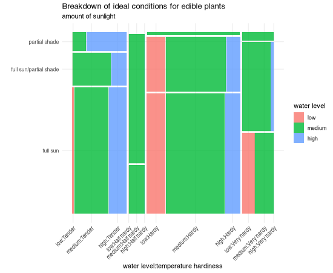</a>

* 2026-01-27 <a href = "https://hardin47.github.io/TidyTuesday/2026-01-27/Brazil_co.html" target = "_blank">Brazilian Companies</a> 

## 2025

* 2025-12-02 <a href = "https://hardin47.github.io/TidyTuesday/2025-12-02/snowman.html" target = "_blank">Sechselaeuten spring festival</a> <a href = "https://hardin47.github.io/TidyTuesday/2025-12-02/snowman.html" target = "_blank">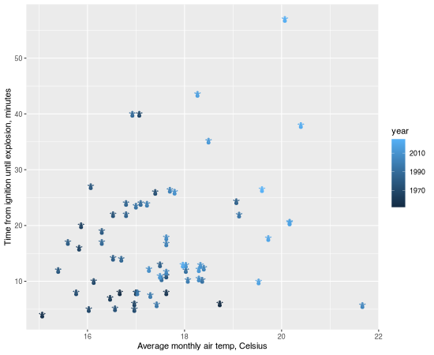</a>

* 2025-11-18 <a href = "https://hardin47.github.io/TidyTuesday/2025-11-18/holmes.html" target = "_blank">The Complete Sherlock Holmes</a> <a href = "https://hardin47.github.io/TidyTuesday/2025-11-18/holmes.html" target = "_blank">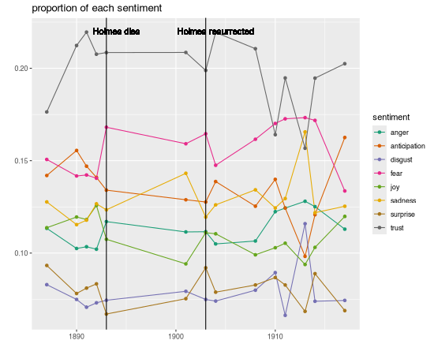</a>

* 2025-11-11 <a href = "https://hardin47.github.io/TidyTuesday/2025-11-11/who.html" target = "_blank">WHO TB burden data</a> 

* 2025-11-04 <a href = "https://hardin47.github.io/TidyTuesday/2025-11-04/flint.html" target = "_blank">Lead concentration in Flint water samples in 2015 (scrollytelling)</a> <a href = "https://hardin47.github.io/TidyTuesday/2025-11-04/flint.html" target = "_blank">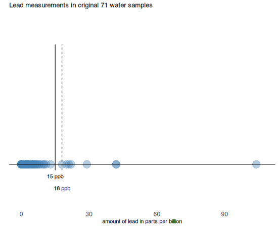</a>

* 2025-10-28 <a href = "https://hardin47.github.io/TidyTuesday/2025-10-28/literary_prize.html" target = "_blank">Selected British Literary Prizes</a> <a href = "https://hardin47.github.io/TidyTuesday/2025-10-28/literary_prize.html" target = "_blank">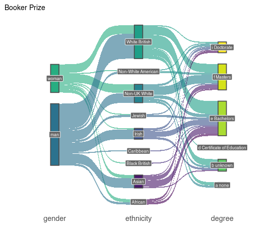</a>

* 2025-10-21 <a href = "https://hardin47.github.io/TidyTuesday/2025-10-21/climate.html" target = "_blank">UK Meteorological & Climate Data</a> <a href = "https://hardin47.github.io/TidyTuesday/2025-10-21/climate.html" target = "_blank">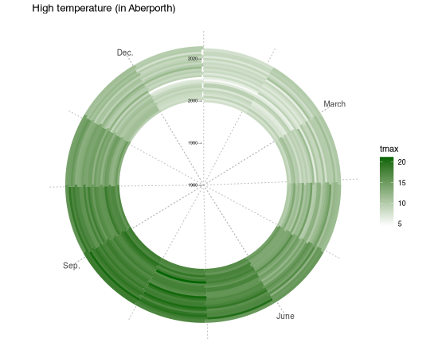</a>

* 2025-10-07 <a href = "https://hardin47.github.io/TidyTuesday/2025-10-07/euroleague.html" target = "_blank">EuroLeague Basketball</a> <a href = "https://hardin47.github.io/TidyTuesday/2025-10-07/euroleague.html" target = "_blank">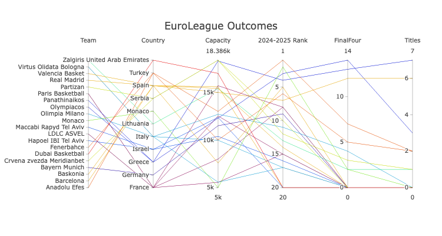</a>

* 2025-09-30 <a href = "https://hardin47.github.io/TidyTuesday/2025-09-30/cranes.html" target = "_blank">Crane Observations at Lake Hornborgasjön, Sweden</a> <a href = "https://hardin47.github.io/TidyTuesday/2025-09-30/cranes.html" target = "_blank">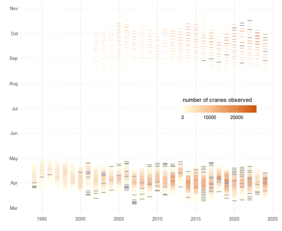</a>

* 2025-09-23 <a href = "https://hardin47.github.io/TidyTuesday/2025-09-23/chess.html" target = "_blank">FIDE Chess Player Ratings</a> <a href = "https://hardin47.github.io/TidyTuesday/2025-09-23/chess.html" target = "_blank">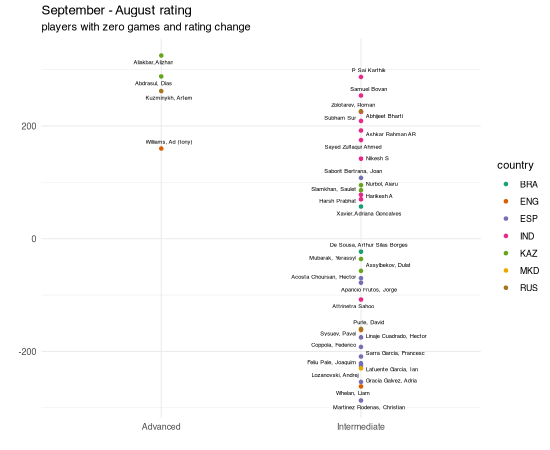</a>

* 2025-09-16 <a href = "https://hardin47.github.io/TidyTuesday/2025-09-16/allrecipes.html" target = "_blank">Allrecipies</a> 

* 2025-09-09 <a href = "https://hardin47.github.io/TidyTuesday/2025-09-09/passports.html" target = "_blank">Henley Passport Index</a> <a href = "https://hardin47.github.io/TidyTuesday/2025-09-09/passports.html" target = "_blank">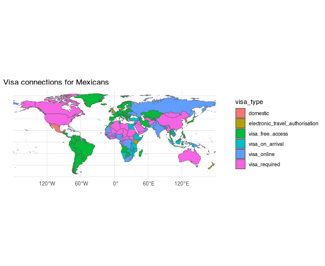</a>

* 2025-09-02 <a href = "https://hardin47.github.io/TidyTuesday/2025-09-02/frogs.html" target = "_blank">Australian frogs</a> <a href = "https://hardin47.github.io/TidyTuesday/2025-09-02/frogs.html" target = "_blank">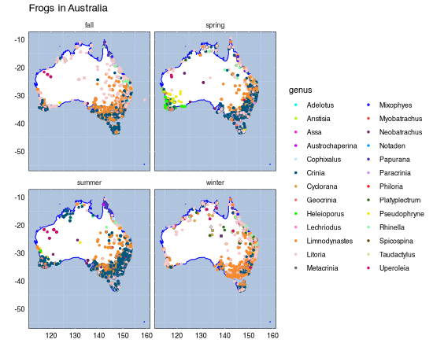</a>

* 2025-07-08 <a href = "https://hardin47.github.io/TidyTuesday/2025-07-08/xkcd_color.html" target = "_blank">xkcd Color Survey</a> <a href = "https://hardin47.github.io/TidyTuesday/2025-07-08/xkcd_color.html" target = "_blank">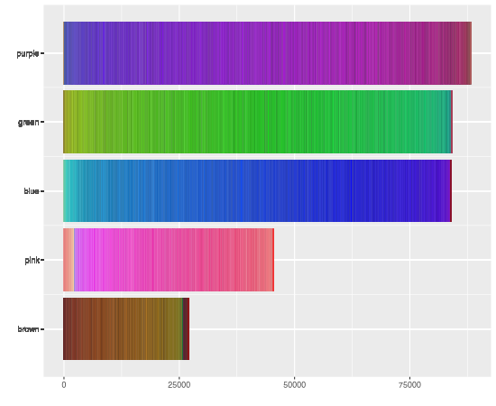</a>

* 2025-06-03 <a href = "https://hardin47.github.io/TidyTuesday/2025-06-03/gutenberg.html" target = "_blank">Project Gutenberg</a> <a href = "https://hardin47.github.io/TidyTuesday/2025-06-03/gutenberg.html" target = "_blank">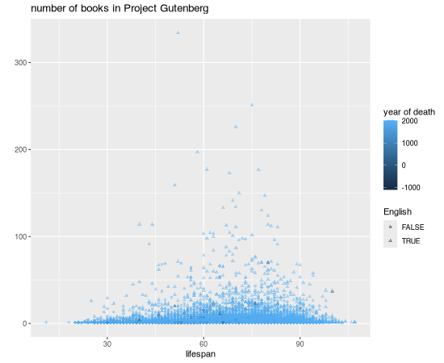</a>

* 2025-04-01 <a href = "https://hardin47.github.io/TidyTuesday/2025-04-01/pokemon.html" target = "_blank">Pokemon</a> <a href = "https://hardin47.github.io/TidyTuesday/2025-04-01/pokemon.html" target = "_blank">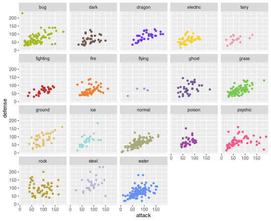</a>

* 2025-03-25 <a href = "https://hardin47.github.io/TidyTuesday/2025-03-25/amazon_reports.html" target = "_blank">Text Data from Amazon's Annual Reports</a> <a href = "https://hardin47.github.io/TidyTuesday/2025-03-25/amazon_reports.html" target = "_blank">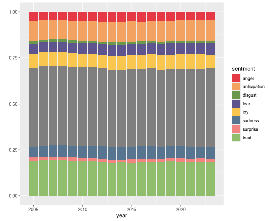</a>

* 2025-03-11 <a href = "https://hardin47.github.io/TidyTuesday/2025-03-11/pixar.html" target = "_blank">Academy Awards for Pixar Films</a> <a href = "https://hardin47.github.io/TidyTuesday/2025-03-1/pixar.html" target = "_blank">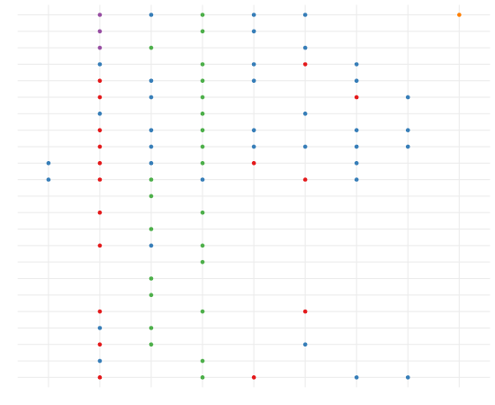</a>

* 2025-03-04 <a href = "https://hardin47.github.io/TidyTuesday/2025-03-04/shelteranimals.html" target = "_blank">Long Beach Animal Shelter</a> <a href = "https://hardin47.github.io/TidyTuesday/2025-03-04/shelteranimals.html" target = "_blank">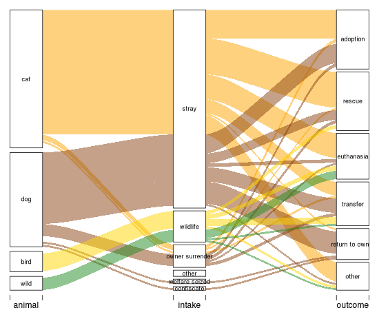</a>

* 2025-02-18 <a href = "https://hardin47.github.io/TidyTuesday/2025-02-18/fbi.html" target = "_blank">FBI Agencies</a> <a href = "https://hardin47.github.io/TidyTuesday/2025-02-18/fbi.html" target = "_blank">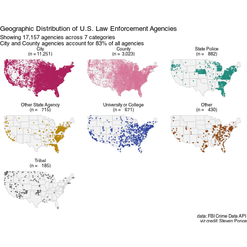</a>

* 2025-02-11 <a href = "https://hardin47.github.io/TidyTuesday/2025-02-11/cdc_data.html" target = "_blank">Missing CDC Data</a> 

* 2025-02-04 <a href = "https://hardin47.github.io/TidyTuesday/2025-02-04/simpsons.html" target = "_blank">The Simpsons</a> <a href = "https://hardin47.github.io/TidyTuesday/2025-02-04/simpsons.html" target = "_blank">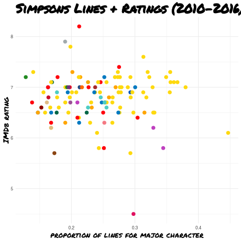</a>

* 2025-01-28 <a href = "https://hardin47.github.io/TidyTuesday/2025-01-28/waterinsecurity.html" target = "_blank">Water Insecurity</a> <a href = "https://hardin47.github.io/TidyTuesday/2025-01-28/waterinsecurity.html" target = "_blank">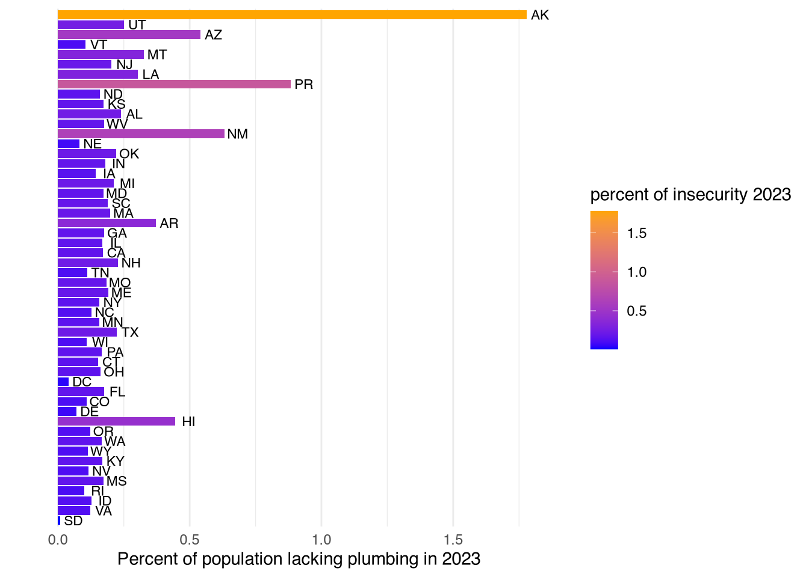</a>

* 2025-01-21 <a href = "https://hardin47.github.io/TidyTuesday/2025-01-21/himalayas.html" target = "_blank">Himalayan Mountaineering Expeditions</a> <a href = "https://hardin47.github.io/TidyTuesday/2025-01-21/himalayas.html" target = "_blank">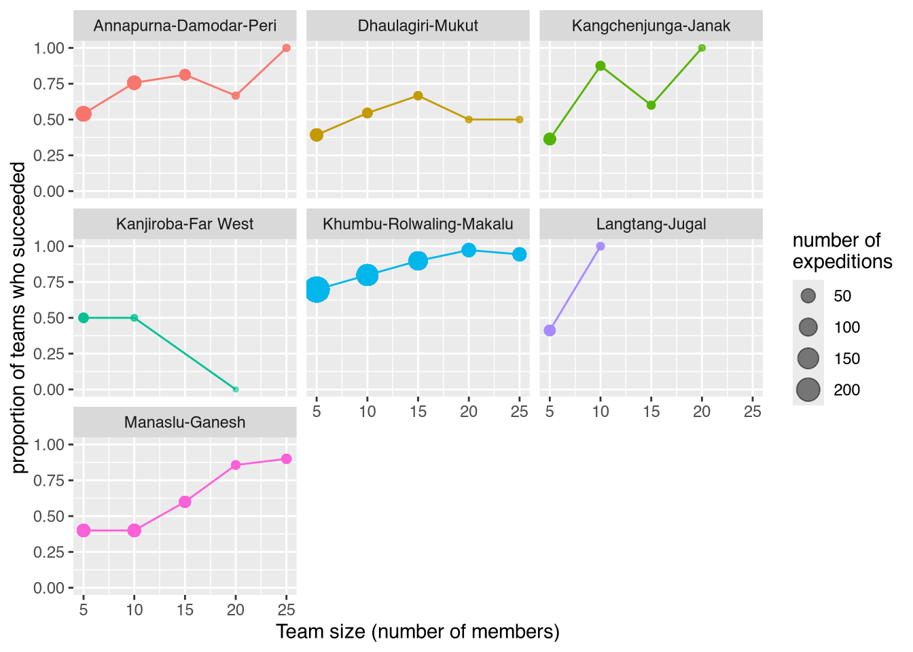</a>

* 2025-01-07 <a href = "https://hardin47.github.io/TidyTuesday/2025-01-07/parfumo.html" target = "_blank">Parfumo Fragrance (in Python)</a> <a href = "https://hardin47.github.io/TidyTuesday/2025-01-07/parfumo.html" target = "_blank">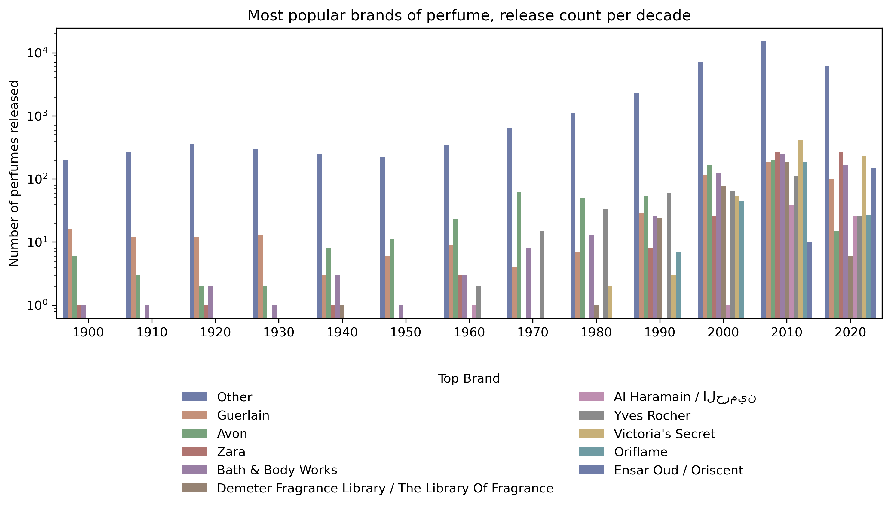</a>

## 2024

* 2024-12-24 <a href = "https://hardin47.github.io/TidyTuesday/2024-12-24/globalholidays.html" target = "_blank">Global Travel (in Python)</a> <a href = "https://hardin47.github.io/TidyTuesday/2024-12-24/globalholidays.html" target = "_blank">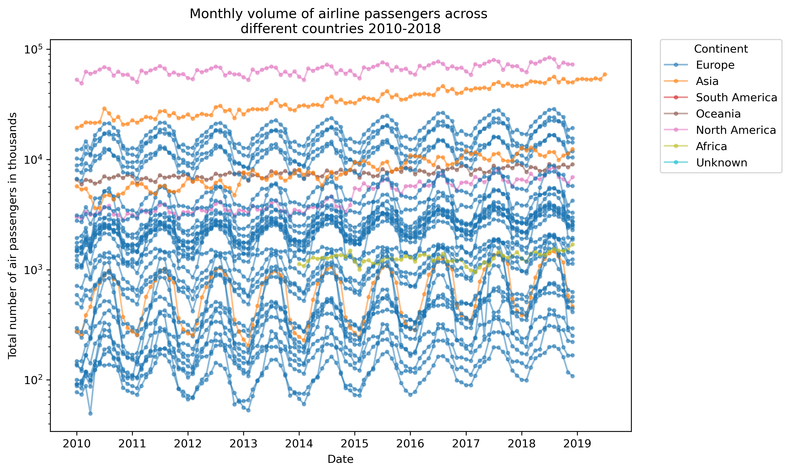</a>

* 2024-12-03 [Tidy Tuesday A64 road](https://hardin47.github.io/TidyTuesday/2024-12-03/a64traffic.html)

* 2024-11-19 [Tidy Tuesday Bob's Burgers](https://hardin47.github.io/TidyTuesday/2024-11-19/bobsburgers.html)

* 2024-11-12 [Tidy Tuesday ISO Codes](https://hardin47.github.io/TidyTuesday/2024-11-12/iso.html)

* 2024-11-05 [Tidy Tuesday Democracy & Dictatorship](https://hardin47.github.io/TidyTuesday/2024-11-05/democracy.html)

* 2024-10-29 <a href = "https://hardin47.github.io/TidyTuesday/2024-10-29/monstermovies.html" target = "_blank">Monster Movies (Regression Tree)</a> <a href = "https://hardin47.github.io/TidyTuesday/2024-10-29/monstermovies.html" target = "_blank">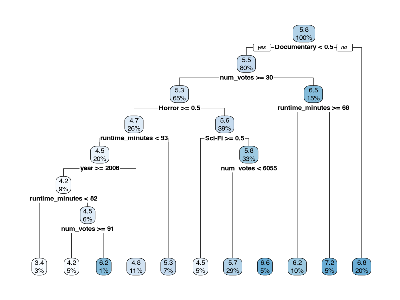</a>

* 2024-10-22 [Tidy Tuesday CIA Factbook](https://hardin47.github.io/TidyTuesday/2024-10-22/ciafact.html)

* 2024-10-08 [Tidy Tuesday National Park Species](https://hardin47.github.io/TidyTuesday/2024-10-08/species.html)

* 2024-10-01 [Tidy Tuesday Chess Games](https://hardin47.github.io/TidyTuesday/2024-10-01/chess.html)

* 2024-09-24 [Tidy Tuesday International Mathematical Olympiad](https://hardin47.github.io/TidyTuesday/2024-09-24/imo.html)

* 2024-09-17 [Tidy Tuesday Shakespeare Dialogue](https://hardin47.github.io/TidyTuesday/2024-09-17/shakespeare.html)

* 2024-09-10 [Tidy Tuesday Economic Diversity and Student Outcomes](https://hardin47.github.io/TidyTuesday/2024-09-10/econdivoutcomes.html)

* 2024-09-03 [Tidy Tuesday Stack Overflow Annual Developer Survey 2024](https://hardin47.github.io/TidyTuesday/2024-09-03/stackoverflow.html)

* 2024-05-07 [Tidy Tuesday Rolling Stone's Best Albums](https://hardin47.github.io/TidyTuesday/2024-05-07/albums.html)

* 2024-04-30 [Tidy Tuesday Worldwide Bureaucracy Indicators](https://hardin47.github.io/TidyTuesday/2024-04-30/wwbi.html)

* 2024-04-23 [Tidy Tuesday Objects Launched into Space](https://hardin47.github.io/TidyTuesday/2024-04-23/space_objects.html)

* 2024-04-16 [Tidy Tuesday Creating a Shiny App](https://hardin47.github.io/TidyTuesday/2024-04-16/shiny.html)

* 2024-04-09 [Tidy Tuesday Solar Eclipse](https://hardin47.github.io/TidyTuesday/2024-04-09/eclipse.html)

* 2024-03-26 [Tidy Tuesday Men's March Madness](https://hardin47.github.io/TidyTuesday/2024-03-26/marchmadness.html)

* 2024-03-19 [Tidy Tuesday Mutant Moneyball](https://hardin47.github.io/TidyTuesday/2024-03-19/mutant_moneyball.html)

* 2024-03-05 [Tidy Tuesday Mr. Trash Wheel](https://hardin47.github.io/TidyTuesday/2024-03-05/trash.html)

* 2024-02-27 [Tidy Tuesday Leap Day Babies](https://hardin47.github.io/TidyTuesday/2024-02-27/leapday.html)

* 2024-02-20 [Tidy Tuesday ISC R grants](https://hardin47.github.io/TidyTuesday/2024-02-20/isc_grants.html)

* 2024-02-13 [Tidy Tuesday Valentine's Day Consumer Data](https://hardin47.github.io/TidyTuesday/2024-02-13/valentines.html)

* 2024-02-06 [Tidy Tuesday UNESCO World Heritage Sites](https://hardin47.github.io/TidyTuesday/2024-02-06/unesco.html)

* 2024-01-30 [Tidy Tuesday Groundhog Day](https://hardin47.github.io/TidyTuesday/2024-01-30/groundhogs.html)

* 2024-01-16 [Tidy Tuesday Polling Places](https://hardin47.github.io/TidyTuesday/2024-01-16/polling.html)

## 2023

* 2023-12-12 [Tidy Tuesday Holiday Movies](https://hardin47.github.io/TidyTuesday/2023-12-12/holidaymovies.html)

* 2023-12-05 [Tidy Tuesday Life Expectancy](https://hardin47.github.io/TidyTuesday/2023-12-05/life_exp.html)

* 2023-11-28 [Tidy Tuesday Dr. Who](https://hardin47.github.io/TidyTuesday/2023-11-28/drwho.html)

* 2023-11-14 [Tidy Tuesday Diwali Sales Data](https://hardin47.github.io/TidyTuesday/2023-11-14/diwali.html)

* 2023-11-07 [Tidy Tuesday US House Results](https://hardin47.github.io/TidyTuesday/2023-11-07/house.html)

* 2023-10-31 [Tidy Tuesday Snopes Horror Articles](https://hardin47.github.io/TidyTuesday/2023-10-31/snopes.html)

* 2023-10-17 [Tidy Tuesday Taylor Swift Songs](https://hardin47.github.io/TidyTuesday/2023-10-17/TS.html)

* 2023-10-10 [Tidy Tuesday Haunted Places](https://hardin47.github.io/TidyTuesday/2023-10-10/haunted.html)

* 2023-10-03 [Tidy Tuesday Grant Opportunities](https://hardin47.github.io/TidyTuesday/2023-10-03/grants.html)

* 2023-09-26 [Tidy Tuesday The Richmond Way](https://hardin47.github.io/TidyTuesday/2023-09-26/richmondway.html)

* 2023-04-25 [Tidy Tuesday London Marathon](https://hardin47.github.io/TidyTuesday/2023-04-25/marathon.html)

* 2023-04-18 [Tidy Tuesday Neolithic Founder Crops](https://hardin47.github.io/TidyTuesday/2023-04-18/crops.html)

* 2023-04-11 [Tidy Tuesday Egg Production](https://hardin47.github.io/TidyTuesday/2023-04-11/eggs.html)

* 2023-04-04 [Tidy Tuesday Premier League](https://hardin47.github.io/TidyTuesday/2023-04-04/premier.html)

* 2023-03-28 [Tidy Tuesday Time Zones](https://hardin47.github.io/TidyTuesday/2023-03-28/time_zones.html)

* 2023-03-21 [Tidy Tuesday Programming Languages](https://hardin47.github.io/TidyTuesday/2023-03-21/prog_lang.html)

* 2023-03-07 [Tidy Tuesday Numbats](https://hardin47.github.io/TidyTuesday/2023-03-07/numbats.html)

* 2023-02-28 [Tidy Tuesday African Language Sentiment](https://hardin47.github.io/TidyTuesday/2023-02-28/afr_sent.html)

* 2023-02-21 [Tidy Tuesday Bob Ross Paintings](https://hardin47.github.io/TidyTuesday/2023-02-21/bobross.html)

* 2023-02-14 [Tidy Tuesday Hollywod Age Gaps](https://hardin47.github.io/TidyTuesday/2023-02-14/love.html)

* 2023-02-07 [Tidy Tuesday Big Tech Stock Prices](https://hardin47.github.io/TidyTuesday/2023-02-07/techstock.html)

* 2023-01-31 [Tidy Tuesday UK Cats](https://hardin47.github.io/TidyTuesday/2023-01-31/cats.html)

* 2023-01-24 [Tidy Tuesday Alone TV](https://hardin47.github.io/TidyTuesday/2023-01-24/alone.html)

* 2023-01-17 [Tidy Tuesday Art History](https://hardin47.github.io/TidyTuesday/2023-01-17/arthistory.html)

## 2022

* 2022-12-06 [Tidy Tuesday Elevators](https://hardin47.github.io/TidyTuesday/2022-12-06/elevators.html)

* 2022-11-08 [Tidy Tuesday Radio Stations](https://hardin47.github.io/TidyTuesday/2022-11-08/radiostations.html)

* 2022-11-01 [Tidy Tuesday Horror Movies](https://hardin47.github.io/TidyTuesday/2022-11-01/horrormovies.html), with corresponding [Shiny app](https://hardin47.shinyapps.io/horrormovies/)

* 2022-10-18 [Tidy Tuesday Stranger Things](https://hardin47.github.io/TidyTuesday/2022-10-18/strangerthings.html)

* 2022-10-11 [Tidy Tuesday Yarn](https://hardin47.github.io/TidyTuesday/2022-10-11/yarn.html)

* 2022-10-04 [Tidy Tuesday Product Hunt](https://hardin47.github.io/TidyTuesday/2022-10-04/product_hunt.html)

* 2022-09-27 [Tidy Tuesday Artists](https://hardin47.github.io/TidyTuesday/2022-09-27/artists.html)

* 2022-09-20 [Tidy Tuesday Wastewater](https://hardin47.github.io/TidyTuesday/2022-09-20/wastewater.html)

* 2022-09-13 [Tidy Tuesday Bigfoot](https://hardin47.github.io/TidyTuesday/2022-09-13/bigfoot.html)

* 2022-09-06 [Tidy Tuesday Legos](https://hardin47.github.io/TidyTuesday/2022-09-06/legos.html)

* 2022-06-28 [Tidy Tuesday Gender Pay Gap](https://hardin47.github.io/TidyTuesday/2022-06-28/paygap.html)

* 2022-06-21 [Tidy Tuesday Celebrating Juneteenth](https://hardin47.github.io/TidyTuesday/2022-06-21/juneteenth.html)

* 2022-06-14 [TidyTuesday Drought](https://hardin47.github.io/TidyTuesday/2022-06-14/drought.html)

* 2022-06-07 [TidyTuesday Pride Donations](https://hardin47.github.io/TidyTuesday/2022-06-07/pride.html)

* 2022-05-31 [TidyTuesday Brand Reputation](https://hardin47.github.io/TidyTuesday/2022-05-31/reputation.html)

* 2022-05-24 [TidyTuesday Women's Rugby](https://hardin47.github.io/TidyTuesday/2022-05-24/womensrugby.html)

* 2022-05-17 [TidyTuesday Eurovision](https://hardin47.github.io/TidyTuesday/2022-05-17/eurovision.html)

* 2022-05-03 [TidyTuesday Wind Turbines](https://hardin47.github.io/TidyTuesday/2022-05-03/wind-turbines.html)

* 2022-04-12 [TidyTuesday Indoor Pollution](https://hardin47.github.io/TidyTuesday/2022-04-12/indoor_pollution.html)

* 2022-04-05 [TidyTuesday News Organizations](https://hardin47.github.io/TidyTuesday/2022-04-05/news.html)

* 2022-03-29 [TidyTuesday NCAA Spending](https://hardin47.github.io/TidyTuesday/2022-03-29/ncaa.html)

* 2022-03-22 [TidyTuesday Babynames](https://hardin47.github.io/TidyTuesday/2022-03-22/babynames.html)

* 2022-03-08 [TidyTuesday Erasmus](https://hardin47.github.io/TidyTuesday/2022-03-08/erasmus.html)

* 2022-03-01 [TidyTuesday Alternative Fuel Stations](https://hardin47.github.io/TidyTuesday/2022-03-01/altfuel.html)

* 2022-02-22 [TidyTuesday Freedom & Democracy](https://hardin47.github.io/TidyTuesday/2022-02-22/freedom.html)

* 2022-02-15 [TidyTuesday DuBois Challenge 2022](https://hardin47.github.io/TidyTuesday/2022-02-15/DuBois2022.html)

* 2022-02-08 [TidyTuesday Tuskegee Airmen](https://hardin47.github.io/TidyTuesday/2022-02-08/tuskegee_air.html)

* 2022-02-01 [TidyTuesday Dog Traits](https://hardin47.github.io/TidyTuesday/2022-02-01/dogs.html)

* 2022-01-11 [TidyTuesday Bee Colonies](https://hardin47.github.io/TidyTuesday/2022-01-11/bees.html)

## 2021

* 2021-11-30 [TidyTuesday Cricket](https://hardin47.github.io/TidyTuesday/2021-11-30/cricket.html)

* 2021-11-09 [TidyTuesday afrimapr](https://hardin47.github.io/TidyTuesday/2021-11-09/afrimapr.html)

* 2021-10-26 [TidyTuesday Ultra Trail  Running](https://hardin47.github.io/TidyTuesday/2021-10-26/running.html)

* 2021-10-05 [TidyTuesday Nursing in the US](https://hardin47.github.io/TidyTuesday/2021-10-05/nurses.html)

* 2021-09-21 [TidyTuesday The Emmy Awards](https://hardin47.github.io/TidyTuesday/2021-09-21/emmys.html)

* 2021-09-14 [TidyTuesday Top 100 Billboard Music](https://hardin47.github.io/TidyTuesday/2021-09-14/music.html)

* 2021-09-07 [TidyTuesday Formula 1 Races](https://hardin47.github.io/TidyTuesday/2021-09-07/formula1.html)

* 2021-08-31 [TidyTuesday Bird Baths](https://hardin47.github.io/TidyTuesday/2021-08-31/birdbaths.html)

* 2021-07-27 [TidyTuesday Olympics](https://hardin47.github.io/TidyTuesday/2021-07-27/olympics.html)

* 2021-07-20 [TidyTuesday Drought across the US](https://hardin47.github.io/TidyTuesday/2021-07-20/drought.html)

* 2021-07-13 [TidyTuesday Scooby Doo](https://hardin47.github.io/TidyTuesday/2021-07-13/scooby.html)

* 2021-06-08 [TidyTuesday Commercial Fishing](https://hardin47.github.io/TidyTuesday/2021-06-08/fishing.html)

* 2021-06-01 [TidyTuesday SurvivoR](https://hardin47.github.io/TidyTuesday/2021-06-01/survivor.html)

* 2021-05-25 [TidyTuesday MarioKart](https://hardin47.github.io/TidyTuesday/2021-05-25/mariokart.html)

* 2021-05-11 [TidyTuesday Access to Broadband](https://hardin47.github.io/TidyTuesday/2021-05-11/broadband.html)

* 2021-05-04 [TidyTuesday Water Sources](https://hardin47.github.io/TidyTuesday/2021-05-04/water.html)

* 2021-04-27 [TidyTuesday CEO Departures](https://hardin47.github.io/TidyTuesday/2021-04-27/CEOs.html)

* 2021-04-20 [TidyTuesday Netflix](https://hardin47.github.io/TidyTuesday/2021-04-20/netflix.html)

* 2021-04-13 [TidyTuesday US Post Offices](https://hardin47.github.io/TidyTuesday/2021-04-13/postoffice.html)

* 2021-04-06 [TidyTuesday Deforestation](https://hardin47.github.io/TidyTuesday/2021-04-06/deforest.html)

* 2021-03-30 [TidyTuesday Makeup Shades](https://hardin47.github.io/TidyTuesday/2021-03-30/shades.html)

* 2021-03-23 [TidyTuesday UN Votes](https://hardin47.github.io/TidyTuesday/2021-03-23/unvotes.html)

* 2021-03-16 [TidyTuesday Video Games](https://hardin47.github.io/TidyTuesday/2021-03-16/videogames.html)

* 2021-03-09 [TidyTuesday The Bechdel Test](https://hardin47.github.io/TidyTuesday/2021-03-09/bechdel.html)

* 2021-03-02 [TidyTuesday Superbowl Commercials](https://hardin47.github.io/TidyTuesday/2021-03-02/superbowl.html)

* 2021-02-23 [TidyTuesday Bureau of Labor Statistics](https://hardin47.github.io/TidyTuesday/2021-02-23/BLS.html)

* 2021-02-16 [TidyTuesday DuBois Challenge 2021](https://hardin47.github.io/TidyTuesday/2021-02-16/DuBois.html)

* 2021-02-09 [TidyTuesday Wealth Inequality in America](https://hardin47.github.io/TidyTuesday/2021-02-09/wealthinequal.html)

* 2021-02-02 [TidyTuesday HBCU enrollment](https://hardin47.github.io/TidyTuesday/2021-02-02/hbcu.html)

* 2021-01-26 [TidyTuesday Plastic Waste](https://hardin47.github.io/TidyTuesday/2021-01-26/plastic.html)

* 2021-01-19 [TidyTuesday of Kenya 2019 Census](https://hardin47.github.io/TidyTuesday/2021-01-19/kenyacensus.html)

* 2021-01-12 [TidyTuesday Tate Art Museum](https://hardin47.github.io/TidyTuesday/2021-01-12/art.html)

* 2021-01-05 [TidyTuesday Transit Cost](https://hardin47.github.io/TidyTuesday/2021-01-05/transit.html)

## 2020

* 2020-12-22 [TidyTuesday Big Mac Exchange Rates](https://hardin47.github.io/TidyTuesday/2020-12-22/bigmac.html)

* 2020-09-01 [TidyTuesday Global Crop Yield](https://hardin47.github.io/TidyTuesday/2020-09-01/crops.html)

* 2020-07-28 [TidyTuesday Palmer Penguins](https://hardin47.github.io/TidyTuesday/2020-07-28/penguins.html)

* 2020-07-21 [TidyTuesday Australian Animals](https://hardin47.github.io/TidyTuesday/2020-07-21/aussieanimals.html)

* 2020-07-14 [TidyTuesday Astronauts](https://hardin47.github.io/TidyTuesday/2020-07-14/astronaut.html)

* 2020-07-07 [TidyTuesday Coffee Ratings](https://hardin47.github.io/TidyTuesday/2020-07-07/coffeeratings.html)

* 2020-06-30 [TidyTuesday X-Men and the Bechdel Test](https://hardin47.github.io/TidyTuesday/2020-06-30/xmen.html)

* 2020-06-16 [TidyTuesday American Slavery and Juneteenth](https://hardin47.github.io/TidyTuesday/2020-06-16/slavery.html)

* 2020-06-09 [TidyTuesday African American Achievements](https://hardin47.github.io/TidyTuesday/2020-06-09/AAA.html)
